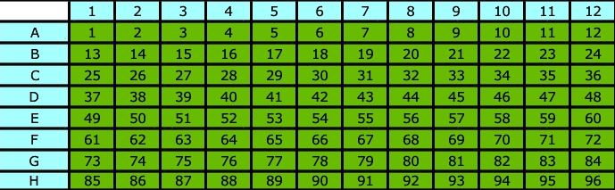

# singleron-RD/rnaseq: Usage

This pipeline is modified based on [nf-core/rnaseq 3.14.0](https://github.com/nf-core/rnaseq/tree/3.14.0) to analyze accuraSCOPE RNA data. 

First, split the FASTQ files into individual wells (cells), and then treat each well as a separate sample to run the nf-core/rnaseq pipeline.

## Usage

```bash
nextflow run singleron-RD/rnaseq \
 -params-file params.yaml -profile docker -bg -resume
```

**params.yaml**
```yaml
input: 'samplesheet.csv'
fasta: /genomePath/Mus_musculus.GRCm39.dna.primary_assembly.fa
gtf: /genomePath/Mus_musculus.GRCm39.110.gtf
star_index: /starIndexPath/
well_sample: /wellSamplePath/well_sample.tsv
outdir: outs
max_cpus: 24
skip_stringtie: true
skip_bigwig: true
skip_fastqc: true
skip_trimming: true
```

**well-sample**

(Required): A TSV file path(must be absolute path) containing well numbers and sample names of wells.

Columns:   
    1st column: Well numbers  
    2nd column: Corresponding sample names

 

Example:
```tsv
25  cell25
26  cell26
27  cell27
28  cell28
29  cell29
30  cell30
31  cell31
```

**samplesheet.csv**
```csv
sample,fastq_1,fastq_2,strandedness
test1,/fastqPath/AEG588A1_S1_L001_R1_001.fastq.gz,/fastqPath/AEG588A1_S1_L001_R2_001.fastq.gz,auto
test1,/fastqPath/AEG588A1_S1_L002_R1_001.fastq.gz,/fastqPath/AEG588A1_S1_L002_R2_001.fastq.gz,auto
```
Each row represents a pair of fastq files (paired end). Rows with the same sample identifier are considered technical replicates and merged automatically.


## Output

In the `split` directory, the following FASTQ files and metric files are included:

- `signal/*.fq.gz`: Reads belonging to sample wells (as defined in the `well_sample.tsv` file)
- `noise/*.fq.gz`: Reads from other wells
- `*_metrics.txt`: Overall read count metrics

  - **total_reads**: Total number of reads in the FASTQ file  
  - **p3_reads**: Number of reads matching the 3′ barcode  
  - **p5_reads**: Number of reads matching the 5′ barcode  
  - **signal_reads**: Reads matching either the 3′ or 5′ barcode and belonging to sample wells  

Example:
```
total_reads:100000
p3_reads:40279 (40.28%)
p5_reads:58773 (58.77%)
signal_reads:98151 (98.15%)
```

- `*_read_count.tsv`: Read counts per well assigned to 3′ and 5′ barcodes  

Example:

```tsv
sample          p3      p5
cell30        7106    9596
cell27        7052    9929
cell31        6042    9164
cell28        5588    8067
cell25        4845    6928
cell29        4830    6331
cell26        4807    7866
noise_well_13   3       1
noise_well_75   2       1
```


For other output files, please refer to the [nf-core/rnaseq documentation](https://nf-co.re/rnaseq/3.14.0/docs/output/) .
